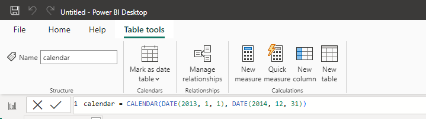

# Senior Power BI Developer Dashboarding Tasks - Answers

## Query Editor

1. **: Import the two tables, "ams" and "emea", and create a new table that appends the two tables into a single table named "ww", from now on, the tables "ams" and "emea" will not be needed**
Use the "Get Data" function to import the excel files, and use "Append Queries as New" function to generate the "ww" table. 

1. **: Convert "Segment" to UPPERCASE**
*On the **Transform** tab, select **Format**, then select **UPPERCASE***

1. **: Change "Month_Name" to "Month"**
*Double-click the **Month Name** column, and rename to just **Month***

1. **: We know the '"Masterby"' product was discontinued last month, so we want to filter out this data from our report to avoid confusion**
*In **Query Editor** filter out "Masterby" using test filters.*

## Data Modelling


1. **Leave only the 'ww' table visible**
 
2. **In "ww" table, create a measure, "Total_Units_Sold" that calculates the sum of "quantity"**
*DAX: Total_Units_Sold = SUM(ww[Quantity])*

3. **Create a new date table, named "Calendar" containing all dates between January 1 2013 and December 31 2014**. This table should contain 3 columns: Date (full date), Month, Year

- In order to create a 'Calendar table', go to the 'Table view'
- Once there go to the 'Table tools' tab and click on 'New table'
- Once there, write the following code in the coding field on the upper part of the screen as shown in the screenshot below:

```calendar = CALENDAR(DATE(2013, 1, 1), DATE(2014, 12, 31))```



- Then on the same 'Table tools' tab, click on'Mark as date table' and select the column containing the dates


4. **Make a relationship between the new "Calendar" table and the "ww" table**
 ![[Pasted image 20230926172825.png]]

## Visuals

1. **Add a date slicer on the extreme left, using the date in the "Calendar" table.**
2. **If Quarter and Day are present in the slicer, please remove them**
3. **Change the font size to 10**
4. **Filter the "blank" year in the slicer.**


5. **Create a line chart to see which month and year had the highest profit**
*From the Fields pane, drag the **Profit** field to a blank area on the report canvas. By default, Power BI displays a column chart with one column, Profit and drag the **Date** field from your Calendar table*

6. **Create a map to display  where the profits were made**

7. **Create a bar chart to determine which products and segments to invest in (highest sales of all time)**

*Answer should be Rimforsa - Small Business and Government*

_____________________________

Developer should be able to produce a PBIX as good as PBI_ww or better.
Attention to details can be spotted if:

- He selects a theme for the View menu; that makes all colors and styles match across visuals.
- He changes the visual title and they're not prefixed as default with "sum of.."
- He fixes the issue with the date being formatted as text in the ww table, and switches the date in the Calendar to Date instead of Date/Time.
- Report looks appealing


# DAX

TBD
